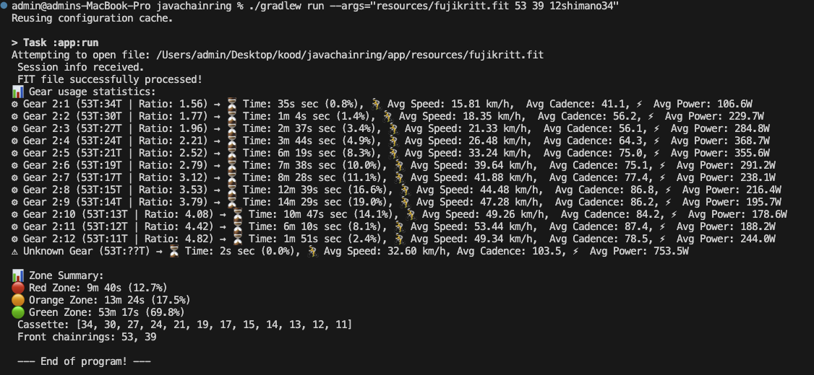

# JAVACHAINRING 🚴‍♂️📊
*A Java-based tool for analyzing cycling gear usage from Garmin FIT files*

---

## 📌 About
JAVACHAINRING is a Java-based application that processes **Garmin FIT files** and extracts key cycling metrics. It tracks **gear usage**, **speed**, **cadence**, and **power output** over time, allowing for **detailed performance analysis**.

Your electronic groupset has to be connected to the bike computer. Program was developed using Garmin and Magene cycling computer files. 

Most useful way to use this tool is to analyze your gear usage after race. Idea is to avoid crosschaining as much as possible. 

## Context to the idea


Here we can say that gears **1st, 2nd, 11th, 12th** are the most unefficient ones. Gears **3rd, 10th** are acceptable.

Everything else is very good. A lot of time was spent in the gears of **11th, 12th**. It can be good idea to change the chainring for bigger one because we spend too much time in the lower part of cassette and almost no time in the higher part of cassette.




---

## 📂 Project Structure
```
JAVACHAINRING/
│── app/
│   ├── resources/               # FIT files for testing
│   ├── src/main/java/org/example/
│   │   ├── App.java             # Main application logic
│   │   ├── GearStats.java       # Gear statistics tracking
│   │   ├── RideData.java        # Data structure for ride records
│   │   ├── RideSummary.java     # Overall ride summary
│   └── src/test/java/org/example/
│       ├── AppTest.java         # Unit tests
│── README.md                    # Project documentation
```

---

## ⚙ Features
✅ **Reads Garmin FIT files** Tested on Garmin, Magene. Probably reads every cycling computer .FIT file.    
✅ **Calculates total usage time for each gear**    
✅ **Tracks every single gear change**  
✅ **Stores ride records(HR, power, speed, cadence)** Though, rest of the info is not for display yet.  
✅ **Generates gear usage statistics**  

---

## 📥 Installation

### 🔧 Requirements
- **Java 21** (or compatible JDK)
- **Gradle** (included in the project via Gradle Wrapper)
- **Garmin FIT SDK** (required for FIT file decoding)

### 📌 Setup
1️⃣ **Clone the repository**  
```sh
git clone https://github.com/siimki/javachainring.git
cd javachainring
```

2️⃣ **Add Garmin FIT SDK**  
- Download `fit.jar` from Garmin FIT SDK  
- Place it in `app/libs/fit.jar`  

3️⃣ **Build the project**  
```sh
./gradlew build
```

---

# 🚴 Gear Usage Analysis - Usage Guide

This program analyzes **gear usage from a FIT file** and helps evaluate drivetrain efficiency, gear selection, and power distribution.

---

## ⚙ Running the Application

### 🔹 Basic Usage
Run the application with a **FIT file** as first argument, big chainring secondary, small chainring as third and cassette as fourth argument:

```
java -jar app.jar resources/example.FIT 53 39 12shimano34
```

Or via **Gradle**:

```
./gradlew run --args="resources/example.FIT 53 39 12shimano34"
```

---

## 📌 Command-Line Arguments
The program accepts multiple arguments to customize the analysis.

### 🔹 Required Arguments
| Argument | Description | Example |
|----------|-------------|---------|
| `1st` | **FIT file path** | `resources/example.FIT` |
| `2nd` | **Big front chainring (T)** | `53` |
| `3rd` | **Small front chainring (T)** | `39` |
| `4th` | **Cassette type** (see format below) | `12shimano34` |

### 🔹 Optional Arguments
You can **filter** the data based on cadence or power.

| Argument | Description | Example |
|----------|-------------|---------|
| `5th` (Optional) | **Min Cadence (RPM)** (Exclude zero cadence) | `30` (Ignore freewheeling) |
| `6th` (Optional) | **Min Power (W)** (Exclude low power efforts) | `200` (Ignore soft pedaling) |

### Example Usage
To analyze gear usage only when **cadence is > 0 RPM** and **power is above 200W**:

```
./gradlew run --args="resources/example.FIT 53 39 12shimano34 0 200"
```
This ensures that **idle coasting** or **soft pedaling** is **not included** in the calculations.

---

## 🔹 Supported Cassettes
The program currently supports **11, 12, and 13-speed** **Shimano and SRAM** cassettes.

**🔹 Cassette Format:**  
```
[speed][brand][largest cog]
```
| Example | Meaning |
|---------|---------|
| `12shimano34` | **12-speed Shimano, largest cog 34T** |
| `11sram32` | **11-speed SRAM, largest cog 32T** |

---

## 📌 Summary of Commands
### ✅ Run Basic Analysis
```
./gradlew run --args="resources/example.FIT 53 39 12shimano34"
```

### ✅ Filter Data (No Coasting, Harder Efforts Only)
```
./gradlew run --args="resources/example.FIT 53 39 12shimano34 1 200"
```

### ✅ Run with Java Directly
```
java -jar app.jar resources/example.FIT 53 39 12shimano34
```

---

### 🚀 Additional Notes
- The **front chainrings and cassette type must be specified** correctly.
- Filtering by cadence and power **helps focus on meaningful data**.
- More cassette types **can be added** in the future.

🚴💨 **Happy riding & analyzing your gear efficiency!**


## 📊 Example Output
```
 Session info received.
 FIT file successfully processed!
📊 Gear usage statistics:
⚙ Gear 2:1 (53T:34T | Ratio: 1.56) → ⏳ Time: 35s sec (0.8%), 🚴 Avg Speed: 15.81 km/h,  Avg Cadence: 41.1, ⚡ Avg Power: 106.6W
⚙ Gear 2:2 (53T:30T | Ratio: 1.77) → ⏳ Time: 1m 4s sec (1.4%), 🚴 Avg Speed: 18.35 km/h,  Avg Cadence: 56.2, ⚡ Avg Power: 229.7W
⚙ Gear 2:3 (53T:27T | Ratio: 1.96) → ⏳ Time: 2m 37s sec (3.4%), 🚴 Avg Speed: 21.33 km/h,  Avg Cadence: 56.1, ⚡ Avg Power: 284.8W
⚙ Gear 2:4 (53T:24T | Ratio: 2.21) → ⏳ Time: 3m 44s sec (4.9%), 🚴 Avg Speed: 26.48 km/h,  Avg Cadence: 64.3, ⚡ Avg Power: 368.7W
⚙ Gear 2:5 (53T:21T | Ratio: 2.52) → ⏳ Time: 6m 19s sec (8.3%), 🚴 Avg Speed: 33.24 km/h,  Avg Cadence: 75.0, ⚡ Avg Power: 355.6W
⚙ Gear 2:6 (53T:19T | Ratio: 2.79) → ⏳ Time: 7m 38s sec (10.0%), 🚴 Avg Speed: 39.64 km/h,  Avg Cadence: 75.1, ⚡ Avg Power: 291.2W
⚙ Gear 2:7 (53T:17T | Ratio: 3.12) → ⏳ Time: 8m 28s sec (11.1%), 🚴 Avg Speed: 41.88 km/h,  Avg Cadence: 77.4, ⚡ Avg Power: 238.1W
⚙ Gear 2:8 (53T:15T | Ratio: 3.53) → ⏳ Time: 12m 39s sec (16.6%), 🚴 Avg Speed: 44.48 km/h,  Avg Cadence: 86.8, ⚡ Avg Power: 216.4W
⚙ Gear 2:9 (53T:14T | Ratio: 3.79) → ⏳ Time: 14m 29s sec (19.0%), 🚴 Avg Speed: 47.28 km/h,  Avg Cadence: 86.2, ⚡ Avg Power: 195.7W
⚙ Gear 2:10 (53T:13T | Ratio: 4.08) → ⏳ Time: 10m 47s sec (14.1%), 🚴 Avg Speed: 49.26 km/h,  Avg Cadence: 84.2, ⚡ Avg Power: 178.6W
⚙ Gear 2:11 (53T:12T | Ratio: 4.42) → ⏳ Time: 6m 10s sec (8.1%), 🚴 Avg Speed: 53.44 km/h,  Avg Cadence: 87.4, ⚡ Avg Power: 188.2W
⚙ Gear 2:12 (53T:11T | Ratio: 4.82) → ⏳ Time: 1m 51s sec (2.4%), 🚴 Avg Speed: 49.34 km/h,  Avg Cadence: 78.5, ⚡ Avg Power: 244.0W
⚠️ Unknown Gear (53T:??T) → ⏳ Time: 2s sec (0.0%), 🚴 Avg Speed: 32.60 km/h, Avg Cadence: 103.5, ⚡ Avg Power: 753.5W

📊 Zone Summary:
🔴 Red Zone: 9m 40s (12.7%)
🟠 Orange Zone: 13m 24s (17.5%)
🟢 Green Zone: 53m 17s (69.8%)
 Cassette: [34, 30, 27, 24, 21, 19, 17, 15, 14, 13, 12, 11]
 Front chainrings: 53, 39
```

---

## Reasearch paper on drivetrain efficiency 

In this reasearch you can find how big losses you have with crosschaining and using suboptimal chainrings and sprockets.

https://cdn.shopify.com/s/files/1/0726/7542/6606/files/cross-chaining-and-ring-size-report.pdf?v=1687253624

