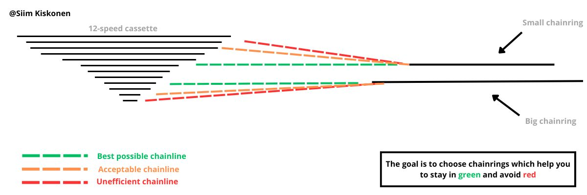
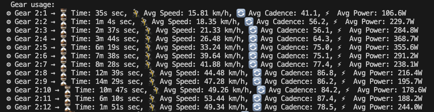

# JAVACHAINRING 🚴‍♂️📊
*A Java-based tool for analyzing cycling performance from Garmin FIT files*

---

## 📌 About
JAVACHAINRING is a Java-based application that processes **Garmin FIT files** and extracts key cycling metrics. It tracks **gear usage**, **speed**, **cadence**, and **power output** over time, allowing for **detailed performance analysis**.

Your electronic groupset has to be connected to the bike computer. Program was developed using Garmin and Magene cycling computer files. 

Most useful way to use this tool is to analyze your gear usage after race. Idea is to avoid crosschaining as much as possible. 

## Context to the idea


Here we can say that gears **1st, 2nd, 11th, 12th** are the most unefficient ones. Gears **3rd, 10th** are acceptable.

everything else is very good. A lot of time was spent in the gears of **11th, 12th**. It can be good idea to change the chainring for bigger one because we spend too much time in the lower part of cassette and almost no time in the higher part of cassette.




---

## 📂 Project Structure
```
JAVACHAINRING/
│── app/
│   ├── resources/               # FIT files for testing
│   ├── src/main/java/org/example/
│   │   ├── App.java             # Main application logic
│   │   ├── GearStats.java       # Gear statistics tracking
│   │   ├── RideData.java        # Data structure for ride records
│   │   ├── RideSummary.java     # Overall ride summary
│   └── src/test/java/org/example/
│       ├── AppTest.java         # Unit tests
│── README.md                      # Project documentation
```

---

## ⚙ Features
✅ **Reads Garmin FIT files** and extracts key data.  
✅ **Tracks gear changes** (front and rear) over time.  
✅ **Stores ride records** including speed, cadence, and power per second.  
✅ **Generates gear usage statistics** (average speed, cadence, and power per gear).  
✅ **Outputs formatted ride data** for deeper analysis.  

---

## 📥 Installation

### 🔧 Requirements
- **Java 21** (or compatible JDK)
- **Gradle** (included in the project via Gradle Wrapper)
- **Garmin FIT SDK** (required for FIT file decoding)

### 📌 Setup
1️⃣ **Clone the repository**  
```sh
git clone https://github.com/YOUR_GITHUB_USERNAME/javachainring.git
cd javachainring
```

2️⃣ **Add Garmin FIT SDK**  
- Download `fit.jar` from Garmin FIT SDK  
- Place it in `app/libs/fit.jar`  

3️⃣ **Build the project**  
```sh
./gradlew build
```

---

##  Usage

### Running the App
Run the application with a FIT file as an argument:
```sh
java -jar app.jar resources/example.FIT
```

Or via **Gradle**:
```sh
./gradlew run --args="resources/example.FIT"
```

---

## 📊 Example Output
```
 Gear usage:
⚙ Gear 2:1 → ⏳ Time: 35s sec, 🚴 Avg Speed: 15.81 km/h, 🔄 Avg Cadence: 41.1, ⚡ Avg Power: 106.6W
⚙ Gear 2:2 → ⏳ Time: 1m 4s sec, 🚴 Avg Speed: 18.35 km/h, 🔄 Avg Cadence: 56.2, ⚡ Avg Power: 229.7W
⚙ Gear 2:3 → ⏳ Time: 2m 37s sec, 🚴 Avg Speed: 21.33 km/h, 🔄 Avg Cadence: 56.1, ⚡ Avg Power: 284.8W
⚙ Gear 2:4 → ⏳ Time: 3m 44s sec, 🚴 Avg Speed: 26.48 km/h, 🔄 Avg Cadence: 64.3, ⚡ Avg Power: 368.7W
⚙ Gear 2:5 → ⏳ Time: 6m 19s sec, 🚴 Avg Speed: 33.24 km/h, 🔄 Avg Cadence: 75.0, ⚡ Avg Power: 355.6W
⚙ Gear 2:6 → ⏳ Time: 7m 38s sec, 🚴 Avg Speed: 39.64 km/h, 🔄 Avg Cadence: 75.1, ⚡ Avg Power: 291.2W
⚙ Gear 2:7 → ⏳ Time: 8m 28s sec, 🚴 Avg Speed: 41.88 km/h, 🔄 Avg Cadence: 77.4, ⚡ Avg Power: 238.1W
⚙ Gear 2:8 → ⏳ Time: 12m 39s sec, 🚴 Avg Speed: 44.48 km/h, 🔄 Avg Cadence: 86.8, ⚡ Avg Power: 216.4W
⚙ Gear 2:9 → ⏳ Time: 14m 29s sec, 🚴 Avg Speed: 47.28 km/h, 🔄 Avg Cadence: 86.2, ⚡ Avg Power: 195.7W
⚙ Gear 2:10 → ⏳ Time: 10m 47s sec, 🚴 Avg Speed: 49.26 km/h, 🔄 Avg Cadence: 84.2, ⚡ Avg Power: 178.6W
⚙ Gear 2:11 → ⏳ Time: 6m 10s sec, 🚴 Avg Speed: 53.44 km/h, 🔄 Avg Cadence: 87.4, ⚡ Avg Power: 188.2W
⚙ Gear 2:12 → ⏳ Time: 1m 51s sec, 🚴 Avg Speed: 49.34 km/h, 🔄 Avg Cadence: 78.5, ⚡ Avg Power: 244.0W
```

---

## Reasearch paper on drivetrain efficiency 

In this reasearch you can find how big losses you have with crosschaining and using suboptimal chainrings and sprockets.

https://cdn.shopify.com/s/files/1/0726/7542/6606/files/cross-chaining-and-ring-size-report.pdf?v=1687253624

